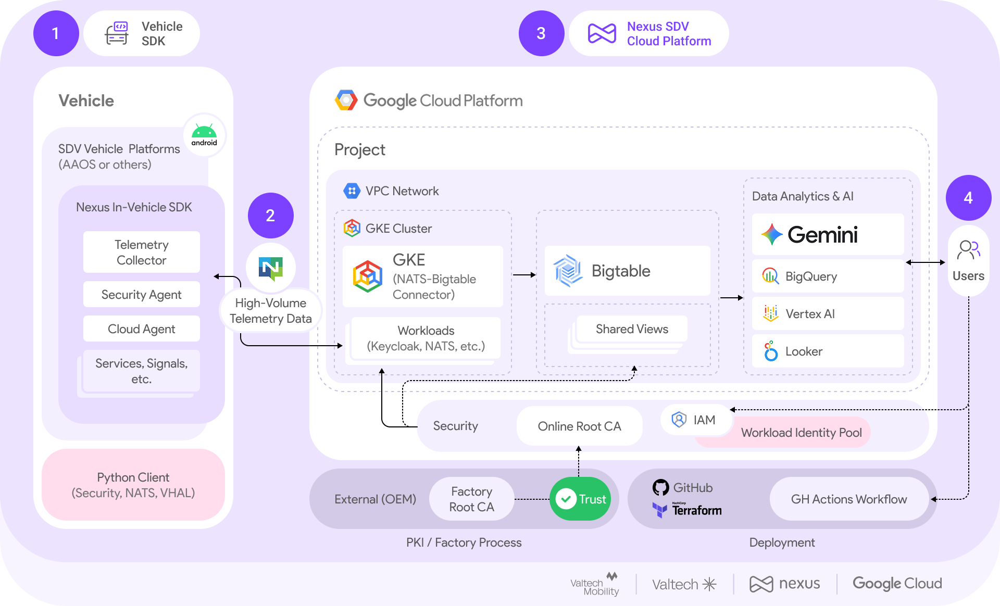

# Nexus SDV
Welcome!

Nexus SDV is a reference implementation for a connected vehicle platform for the Software Defined Vehicle.

## Overview and Vision

**Nexus SDV** is an open-source platform designed to simplify the integration of diverse automotive in-vehicle software platforms, such as Android Automotive OS (AAOS). By providing a connected vehicle platform reference implementation that enables the leverage of (Gen)AI at scale, it focuses specifically on the developer's need to iterate rapidly within environments that mirror production scenarios.

The core objective is to provide a **simple, flexible, and standardized communication protocol** for **bidirectional vehicle-to-cloud data exchange**, enabling both seamless telemetry ingestion and remote command/configuration flows.

## Getting Started

Nexus is designed to be deployed directly into your Google Cloud environment. To ensure a seamless and reproducible setup, the deployment is fully automated using **Terraform**.

Follow our **[Online Setup Guide](https://docs.nexus-sdv.io)** to get started. You will find a comprehensive list of prerequisites and a step-by-step walkthrough on how to provision and configure **your own Nexus platform instance in Google Cloud**.

## Architecture Overview

### Technology Stack and Data Flow

* **Vehicle-Side Standards:** Nexus SDV relies on established automotive standards, such as the **Android Automotive OS Vehicle Hardware Abstraction Layer (AAOS VHAL)**, to efficiently collect and abstract vehicle data.
* **Data Transmission:** Telemetry data is transported to the cloud platform using the high-performance **NATS protocol**.
* **Data Processing and Storage:** The platform receives the data and leverages the scalability of **Google BigTable** for powerful processing and persistence.

### Automotive-Grade Security

The platform defines and implements a **well-proven, automotive-grade security standard** to establish trust between the vehicle and the cloud. This security framework is built upon **industry-standard mechanisms** such as **Public Key Infrastructure (PKI)** and **OpenID 2.0**.

### Developer Experience & Rapid Prototyping

The platform is designed to accelerate the work of Connected Vehicle developers. Through **simple installation and uninstallation**, Nexus SDV promotes innovative Proof-of-Concept projects and minimizes overhead for new experiments.

### Enabling AI and Data Processing (Digital Twin)

By bridging vehicle signals and data to the cloud, Nexus establishes a **unified domain layer** between the vehicle and the cloud. This architecture acts as a **Virtual Electronic Control Unit (ECU)** or **Digital Twin**, enabling the native and simple use of **AI tools and data-implementing services**.

## Outlook and Community

We plan to continuously develop and maintain this project to provide you with more features and enable partners to offer complementary features. **We rely on your feedback and contributions.**

## Release Notes

For a detailed record of changes, including new features, improvements, and version history, please refer to our **[Changelog](docs/changelog.md)**.

## Disclaimer

This is not an officially supported Google product. This project is not
eligible for the [Google Open Source Software Vulnerability Rewards
Program](https://bughunters.google.com/open-source-security).
